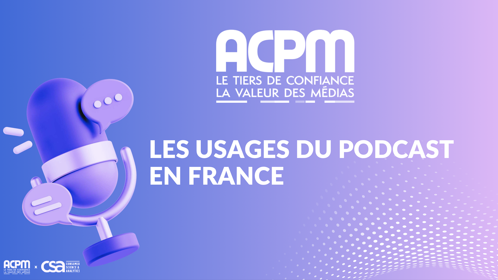
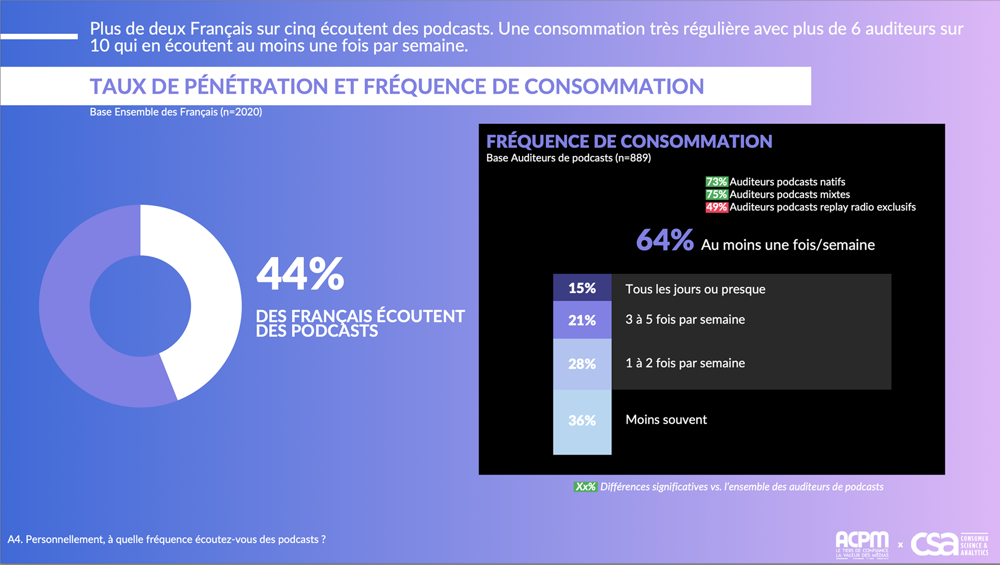
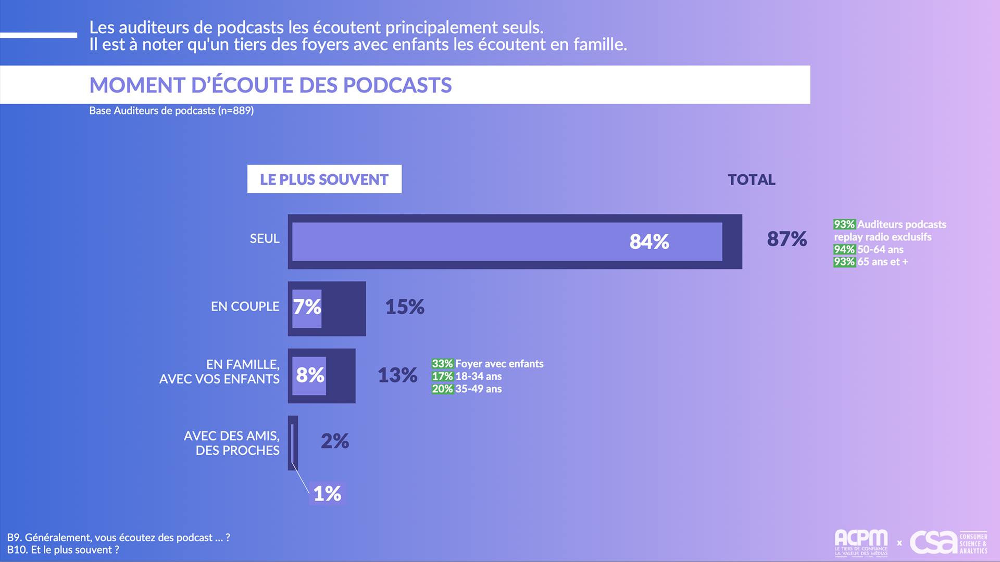
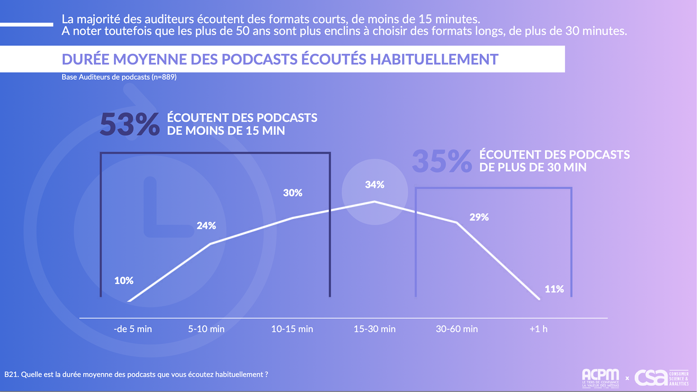
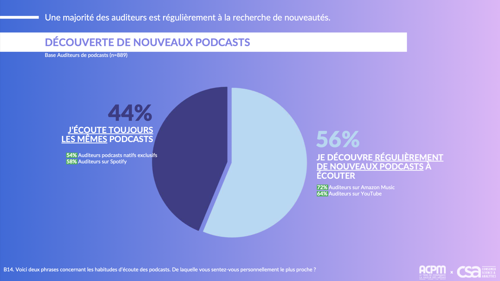
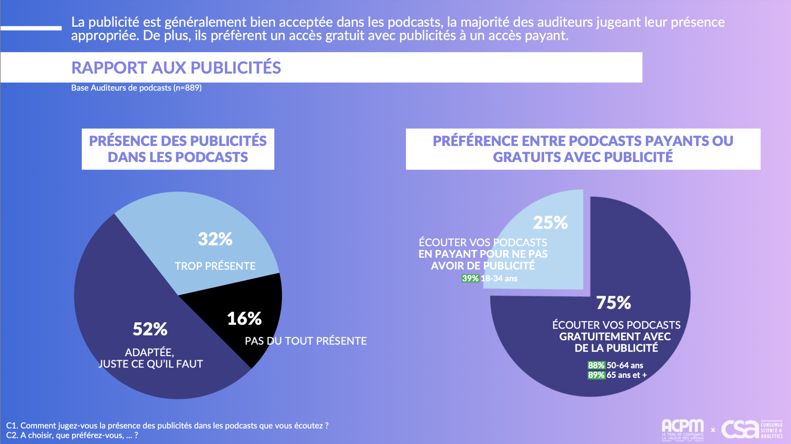

<!-- _class: section -->

## Introduction

---

<!-- _class: columns-3 -->

## Alexandre Allain
Producteur et animateur de podcast

 
### Salut les designers
Le podcast de l'agence LunaWeb

 
### Parlez-moi de sport !
Le podcast qui vous motive, par Giropharm

 
### AZERTY
L'émission qui reconnecte

---

<!-- _class: image-left -->
<!-- _backgroundImage: url('https://www.leparisien.fr/resizer/QPFn5ianNoeYsLfeKpUS1yftSiM=/932x582/cloudfront-eu-central-1.images.arcpublishing.com/leparisien/IB5KZXKWCVGEBNHOG4HHBJ5GJE.jpg') -->

## D’où vient le terme “podcast” ?

- "iPod" et "broadcast" (qui signifie "diffusion" en anglais)

- Adam Curry et Dave Winer expérimentaient une nouvelle façon de diffuser du contenu audio via RSS

- Apple s'est approprié le terme et l'a rendu grand public en l'introduisant dans la version 4.9 de iTunes.

---

<!-- _class: image-right -->
<!-- _backgroundImage: url('https://img-api.mac4ever.com/1000/0/da27428d1f_apple-podcast.webp') -->

## Pourquoi le podcast explose ?

- Développement grâce à un contexte technologique favorable : l’iPod puis le smartphone

- Écoute mobile (transports, sport, tâches quotidiennes) et accès simplifié par les plateformes d’écoute

- Une écoute intime et personnelle

- Une expertise, un format prévu pour le long

---

<!-- _class: image-left -->
<!-- _backgroundImage: url('https://i0.wp.com/vipzone.fr/wp-content/uploads/2025/07/Mehdi-Maizi-1024x996.jpeg?resize=1024%2C996&ssl=1') -->

## Depuis 2018 : une professionnalisation du domaine

- Montée en qualité éditoriale et sonore : arrivée de professionnel du son, de l’éditorial

- Développement de modèles économiques : apparition de podcast de marques, de publicité et de sponsors

- Explosion des formats, crosspost, diversité d’auteurs

---

<!-- _class: section -->

## Le podcast aujourd'hui

---

<!-- _class: image-full -->

---

<!-- _class: image-full -->

---

<!-- _class: columns-2 -->

## Quels types de podcast ?

### Podcast replay radio
un replay d’une émission diffusée en radio

### Podcast natif
Contenus audio jamais diffusés en radio

---

<!-- _class: columns-2 -->

## Quels types de podcast ?
Zone grise - considéré comme podcast natif - Vodcast

 
### Les replay “internet”
un replay d’une émission diffusée en direct sur internet, le plus souvent Twitch

 
### Contenu internet natif, disponible à l’audio
L’audio d’une vidéo, disponible sur les plateformes

---

<!-- _class: image-full -->

---

<!-- _class: image-left -->
<!-- _backgroundImage: url('https://i0.wp.com/vipzone.fr/wp-content/uploads/2025/07/Mehdi-Maizi-1024x996.jpeg?resize=1024%2C996&ssl=1') -->

## Un format intimiste

- Une attention exclusive

- Flexibilité et un rythme personnel (consommation en mobilité pour près de 6 auditeurs sur 10)

- Une opportunité réelle pour du contenu ciblé et qualifié

---

<!-- _class: image-full -->

---

<!-- _class: image-full -->

---

<!-- _class: image-full -->

---

## Retombées marques

- **Les auditeurs acceptent la publicité**. Nous ne sommes pas dans le cas de YouTube, Twitch, etc.

- **Les auditeurs veulent du contenu de marque**. La majorité estime que les marques devraient aborder des sujets qu'elles soutiennent plutôt que de parler d'elles-mêmes.

- **76 % des auditeurs estiment que c'est un bon moyen de communication**
